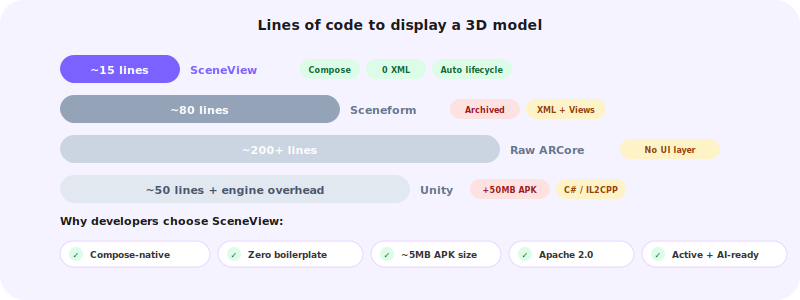

# SceneView vs. the alternatives

An honest comparison for developers evaluating 3D and AR options.

<div style="text-align: center; margin: 1.5rem 0;">

</div>

---

## The landscape

| Library | Approach | Status |
|---|---|---|
| **SceneView** | Jetpack Compose composables, Filament + ARCore | Active, v3.4.7 |
| **Google Sceneform** | View-based, custom renderer, ARCore | Abandoned (archived 2021) |
| **Raw ARCore SDK** | Low-level session/frame API, bring your own renderer | Active but no UI layer |
| **Unity** | Full game engine embedded via `UnityPlayerActivity` | Active, heavy |
| **Rajawali** | OpenGL ES wrapper, imperative scene graph | Maintenance mode |

---

## Side-by-side: adding a 3D model viewer

=== "SceneView"

    ```kotlin
    // build.gradle
    implementation("io.github.sceneview:sceneview:3.4.7")

    // One composable
    @Composable
    fun ModelViewer() {
        val engine = rememberEngine()
        val modelLoader = rememberModelLoader(engine)
        val model = rememberModelInstance(modelLoader, "models/helmet.glb")

        Scene(
            modifier = Modifier.fillMaxSize(),
            engine = engine,
            modelLoader = modelLoader,
            cameraManipulator = rememberCameraManipulator()
        ) {
            model?.let { ModelNode(modelInstance = it, scaleToUnits = 1.0f) }
        }
    }
    ```

    **~15 lines** · 1 file · 0 XML · 0 lifecycle callbacks · 0 manual cleanup

=== "Sceneform (archived)"

    ```kotlin
    // XML layout required
    // <fragment android:name="com.google.ar.sceneform.ux.ArFragment" />

    class ModelViewerActivity : AppCompatActivity() {
        private lateinit var arFragment: ArFragment

        override fun onCreate(savedInstanceState: Bundle?) {
            super.onCreate(savedInstanceState)
            setContentView(R.layout.activity_model_viewer)
            arFragment = supportFragmentManager
                .findFragmentById(R.id.arFragment) as ArFragment

            arFragment.setOnTapArPlaneListener { hitResult, _, _ ->
                val anchor = hitResult.createAnchor()
                ModelRenderable.builder()
                    .setSource(this, Uri.parse("helmet.sfb"))
                    .build()
                    .thenAccept { renderable ->
                        val anchorNode = AnchorNode(anchor)
                        anchorNode.setParent(arFragment.arSceneView.scene)
                        val modelNode = TransformableNode(
                            arFragment.transformationSystem)
                        modelNode.renderable = renderable
                        modelNode.setParent(anchorNode)
                    }
            }
        }

        override fun onResume() { super.onResume() }
        override fun onPause() { super.onPause() }
        override fun onDestroy() { super.onDestroy() }
    }
    ```

    **~80+ lines** · 3+ files · Manual lifecycle · `.sfb` format deprecated

=== "Raw ARCore"

    ```kotlin
    // You get a Session, Frame, and Camera. That's it.
    // Bring your own renderer (OpenGL ES or Vulkan).
    // Manage GL surface, shader compilation, mesh uploading,
    // lighting, shadows, and frame timing yourself.
    ```

    **500–1000+ lines** before rendering a single triangle

=== "Unity"

    ```kotlin
    // Unity export as Android library
    implementation(project(":unityLibrary"))

    class UnityViewerActivity : UnityPlayerActivity() {
        // All logic in C# inside Unity
    }
    ```

    **40–350 MB** APK overhead · No Compose integration · Separate build pipeline

---

## Feature matrix

| Feature | SceneView | Sceneform | Raw ARCore | Unity |
|---|---|---|---|---|
| Jetpack Compose | **Native** | No | No | No |
| Declarative nodes | **Yes** | No (imperative) | No API | No (C#) |
| Auto lifecycle | **Yes** | Manual | Manual | Unity-managed |
| PBR rendering | **Filament** | Limited | DIY | Unity renderer |
| glTF/GLB | **Yes** | .sfb (deprecated) | DIY | Yes |
| Physics | **Built-in** | No | No | Built-in |
| Post-processing | **Bloom, DOF, SSAO** | No | DIY | Yes |
| Dynamic sky | **Yes** | No | No | Yes (HDRP) |
| AR planes | **Yes** | Yes | Yes | Yes |
| AR image tracking | **Yes** | Yes | Yes | Yes |
| AR face tracking | **Yes** | Yes | Yes | Yes |
| Cloud anchors | **Yes** | Yes | Yes | Yes |
| Geospatial API | **Yes** | No | Yes | Yes |
| ViewNode (Compose in 3D) | **Yes** | No | No | No |
| AI tooling (MCP) | **Yes** | No | No | No |
| APK size impact | **~5 MB** | ~3 MB | ~1 MB | 40–350 MB |
| Active maintenance | **Yes** | Abandoned | Google | Yes |

---

## Common objections

!!! question "We already use Unity for 3D"
    Unity is right for 3D-first games. But for adding 3D to an existing Compose app — a product
    viewer, an AR feature, data visualization — Unity's 60–350 MB runtime, separate C# pipeline,
    and no Compose integration make it overkill. SceneView adds ~5 MB and works inside your
    existing Compose screens.

!!! question "Can't we just use ARCore directly?"
    ARCore gives you tracking data (planes, anchors, poses) but no rendering. You'd need your
    own OpenGL/Vulkan renderer — months of work for a team with graphics expertise. SceneView
    gives you ARCore + Filament rendering, wrapped in Compose composables.

!!! question "Sceneform worked fine for us"
    Google archived Sceneform in 2021. The `.sfb` format is deprecated. No Compose support.
    No new ARCore features (geospatial, streetscape, depth). The community fork has unresolved
    issues including 16 KB page size compliance required by Android 15 (API 35).
    See the [Migration guide](migration.md) for a step-by-step walkthrough.

!!! question "Is it production-ready?"
    Yes. SceneView is built on Filament (Google's production rendering engine) and ARCore
    (Google's production AR platform). Used in production apps on Google Play. The API is
    stable and versioned with migration guides for breaking changes.

---

## Migration from Sceneform

| Sceneform | SceneView |
|---|---|
| `ArFragment` | `ARScene { }` composable |
| `ModelRenderable.builder()` | `rememberModelInstance(modelLoader, path)` |
| `AnchorNode(anchor).setParent(scene)` | `AnchorNode(anchor = a) { ... }` |
| `TransformableNode` | `ModelNode` with gesture parameters |
| `.sfb` model format | `.glb` / `.gltf` (standard glTF) |
| `onResume` / `onPause` / `onDestroy` | Automatic (Compose lifecycle) |
| `node.setParent(null); node.destroy()` | Remove from composition |

[:octicons-arrow-right-24: Full migration guide](migration.md)
