# SceneView

<p class="hero-tagline">3D & AR for every platform — native Android, native iOS, React Native, Flutter, and beyond.</p>

<div class="platform-badges" markdown>
<span class="platform-badge platform-badge--android">Android Native</span>
<span class="platform-badge platform-badge--ios">iOS Native <small>v4.1</small></span>
<span class="platform-badge platform-badge--xr">XR Headsets</span>
<span class="platform-badge platform-badge--react">React Native</span>
<span class="platform-badge platform-badge--flutter">Flutter</span>
<span class="platform-badge platform-badge--desktop">TV · Auto · Desktop</span>
</div>

[:octicons-arrow-right-24: Start building](#get-started){ .md-button .md-button--primary }
[:octicons-download-24: Try the demo](try.md){ .md-button .md-button--primary }
[:octicons-mark-github-24: View on GitHub](https://github.com/SceneView/sceneview-android){ .md-button }

<!-- Platform devices hero — shows every supported form factor -->
<div class="infographic">
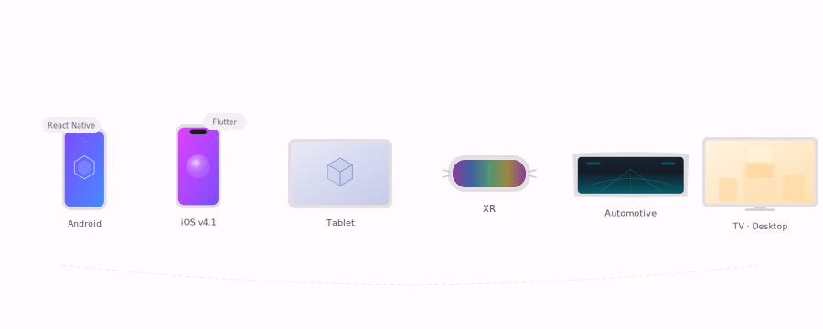
</div>

---

<!-- Tech ecosystem bar -->
<div class="tech-logos">
<span class="tech-logo">Jetpack Compose</span>
<span class="tech-logo">SwiftUI</span>
<span class="tech-logo">Google Filament</span>
<span class="tech-logo">ARCore</span>
<span class="tech-logo">ARKit</span>
<span class="tech-logo">Kotlin Multiplatform</span>
<span class="tech-logo">glTF / GLB</span>
</div>

<!-- Key numbers -->
<div class="stat-row">
<span class="stat-pill"><strong>26+</strong> built-in nodes</span>
<span class="stat-pill"><strong>60fps</strong> on mid-range devices</span>
<span class="stat-pill"><strong>6</strong> platforms supported</span>
<span class="stat-pill"><strong>Apache 2.0</strong> open source</span>
</div>

---

## See what you can build

SceneView powers production apps in e-commerce, automotive, healthcare, and more. Same composable API — from a 5" phone to a 65" TV to XR headsets.

<!-- Visual showcase wall — 3 large illustrations side by side -->
<div class="visual-wall">

<div class="visual-card">

<div class="visual-card__badge">Made with SceneView</div>
<h3>E-commerce</h3>
<p>3D product viewers with 360° rotation and AR try-on. Drop a <code>Scene {}</code> where you'd use an <code>Image()</code>.</p>
</div>

<div class="visual-card">

<div class="visual-card__badge">Made with SceneView</div>
<h3>Education & STEM</h3>
<p>Interactive 3D globes, solar systems, molecular viewers, anatomy labs — bring learning to life with <code>Scene {}</code>.</p>
</div>

<div class="visual-card">

<div class="visual-card__badge">Made with SceneView</div>
<h3>Automotive HUD</h3>
<p>Heads-up displays, 3D navigation arrows, speed overlays on Android Automotive. Multiple <code>Scene {}</code> on one screen.</p>
</div>

<div class="visual-card">
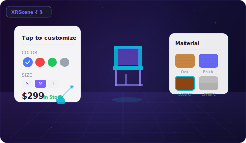
<div class="visual-card__badge">Made with SceneView</div>
<h3>XR spatial computing</h3>
<p>Floating 3D models with Compose UI panels in spatial space. <code>XRScene {}</code> + <code>ViewNode</code> for cards, buttons, pickers.</p>
</div>

</div>

<!-- More industry use cases -->
<div class="industry-grid">

<div class="industry-card">

<div class="industry-card__content">
<h3>Healthcare & education</h3>
<p>Interactive 3D anatomy models, molecular structures, and mechanical assemblies. Students control everything with standard Compose UI — sliders, buttons, toggles.</p>
</div>
</div>

<div class="industry-card">

<div class="industry-card__content">
<h3>Real estate</h3>
<p>Walk through 3D floor plans, preview renovations in AR, compare lighting conditions. <code>PortalNode</code> lets users peek through doors into furnished rooms.</p>
</div>
</div>

<div class="industry-card">

<div class="industry-card__content">
<h3>Gaming & entertainment</h3>
<p>Build 3D mobile games without a game engine. <code>PhysicsNode</code> for collisions, dynamic lighting, Compose UI overlays for HUD — all at 60fps on mid-range devices.</p>
</div>
</div>


</div>

---

## How it works

Write a `Scene { }` the same way you write a `Column { }`. Nodes are composables.
State drives the scene. Lifecycle is automatic.

<!-- Visual flow diagram -->
<div class="infographic">
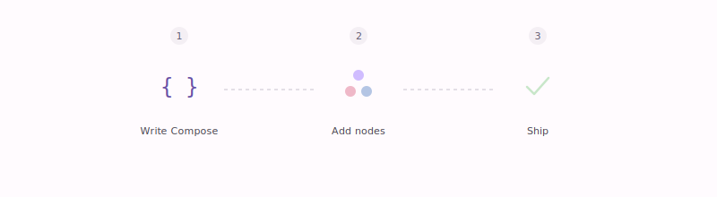
</div>

<!-- Composable tree diagram -->
<div class="infographic infographic--small">
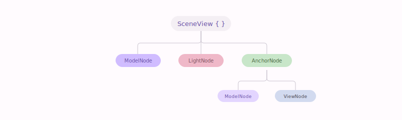
</div>

=== "Product viewer"

    ```kotlin
    @Composable
    fun ProductViewer() {
        val engine = rememberEngine()
        val modelLoader = rememberModelLoader(engine)
        val shoe = rememberModelInstance(modelLoader, "models/shoe.glb")

        Scene(
            modifier = Modifier.fillMaxWidth().height(300.dp),
            engine = engine,
            cameraManipulator = rememberCameraManipulator()
        ) {
            shoe?.let {
                ModelNode(modelInstance = it, scaleToUnits = 1.0f, autoAnimate = true)
            }
            LightNode(type = LightManager.Type.SUN, apply = { intensity(100_000.0f) })
        }
    }
    ```

    Ten lines. Your users can rotate, zoom, and inspect a product in 3D — inside your existing Compose layout.

=== "AR placement"

    ```kotlin
    @Composable
    fun FurniturePlacement() {
        var anchor by remember { mutableStateOf<Anchor?>(null) }
        val engine = rememberEngine()
        val modelLoader = rememberModelLoader(engine)
        val sofa = rememberModelInstance(modelLoader, "models/sofa.glb")

        ARScene(
            modifier = Modifier.fillMaxSize(),
            engine = engine,
            planeRenderer = true,
            onSessionUpdated = { _, frame ->
                if (anchor == null) {
                    anchor = frame.getUpdatedPlanes()
                        .firstOrNull { it.type == Plane.Type.HORIZONTAL_UPWARD_FACING }
                        ?.let { frame.createAnchorOrNull(it.centerPose) }
                }
            }
        ) {
            anchor?.let { a ->
                AnchorNode(anchor = a) {
                    sofa?.let {
                        ModelNode(modelInstance = it, scaleToUnits = 0.5f, isEditable = true)
                    }
                }
            }
        }
    }
    ```

    Tap to place. Pinch to scale. Two-finger rotate. All built in.

=== "XR spatial"

    ```kotlin
    @Composable
    fun SpatialShowroom() {
        XRScene(modifier = Modifier.fillMaxSize()) {
            ModelNode(
                modelInstance = furniture,
                position = Position(0f, 0f, -2f)
            )
            ViewNode(position = Position(0.5f, 1.5f, -1.5f)) {
                Card {
                    Text("Tap to customize")
                    ColorPicker(onColorSelected = { /* update material */ })
                }
            }
        }
    }
    ```

    Same composable API — now in spatial computing headsets.

=== "iOS (v4.0)"

    ```swift
    struct ProductViewer: View {
        var body: some View {
            SceneView {
                ModelNode("models/shoe.usdz", scaleToUnits: 1.0)
                    .playAllAnimations()
                LightNode(.directional)
            }
            .cameraControls(.orbit)
        }
    }
    ```

    Same mental model — SwiftUI + RealityKit under the hood. Share your scene graph via Kotlin Multiplatform.

[:octicons-arrow-right-24: v4.0 multi-platform roadmap](v4-preview.md){ .md-button }

---

## Ask AI, get a 3D scene

The most AI-friendly 3D library. Ships with an MCP server and `llms.txt` API reference — so Claude, Cursor, and Copilot always have the current API.

<div class="prompt-showcase">
<div class="prompt-showcase__header">💬 You describe it → AI writes the code → SceneView renders it</div>
<div class="prompt-showcase__prompt">
"Add a 3D product viewer to my shopping app. Users should rotate the sneaker model and tap a button to see it in AR in their room."
</div>
<div class="prompt-showcase__arrow">↓</div>
<div class="prompt-showcase__result">

```kotlin
@Composable
fun ProductDetail(modelPath: String) {
    var showAR by remember { mutableStateOf(false) }
    val engine = rememberEngine()
    val modelLoader = rememberModelLoader(engine)
    val model = rememberModelInstance(modelLoader, modelPath)

    if (showAR) {
        ARScene(modifier = Modifier.fillMaxSize(), engine = engine, planeRenderer = true,
            onSessionUpdated = { _, frame -> /* anchor placement */ }
        ) { /* AR content */ }
    } else {
        Scene(modifier = Modifier.fillMaxWidth().height(350.dp), engine = engine,
            cameraManipulator = rememberCameraManipulator()
        ) {
            model?.let { ModelNode(modelInstance = it, scaleToUnits = 1.0f) }
        }
    }
    Button(onClick = { showAR = !showAR }) { Text(if (showAR) "Back to 3D" else "View in AR") }
}
```

</div>
</div>

<span class="feature-chip feature-chip--primary">MCP server included</span>
<span class="feature-chip feature-chip--secondary">llms.txt API reference</span>
<span class="feature-chip feature-chip--tertiary">Works with Claude · Cursor · Copilot</span>

[:octicons-arrow-right-24: AI-assisted development](ai-development.md){ .md-button }

---

## Install

=== "3D only"

    ```kotlin
    dependencies {
        implementation("io.github.sceneview:sceneview:3.2.0")
    }
    ```

=== "3D + AR"

    ```kotlin
    dependencies {
        implementation("io.github.sceneview:arsceneview:3.2.0")
    }
    ```

=== "XR (v4.0)"

    ```kotlin
    dependencies {
        implementation("io.github.sceneview:sceneview-xr:4.0.0")
    }
    ```

!!! tip "That's it"
    No XML layouts. No fragments. No OpenGL boilerplate. Just add the dependency and start composing.

---

## What you get

### 26+ composable node types — visual overview

<!-- Node types visual catalog -->
<div class="infographic">
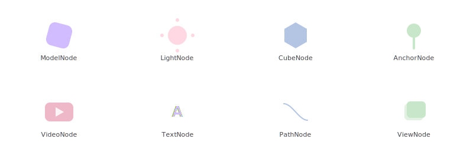
</div>

<div class="grid cards" markdown>

-   :octicons-package-24: **3D Models**

    ---

    `ModelNode` loads glTF/GLB with animations, gestures, and automatic scaling.
    Geometry primitives — `CubeNode`, `SphereNode`, `CylinderNode`, `PlaneNode` — need no asset files.

    [:octicons-arrow-right-24: Model loading guide](recipes.md#loading-display)

-   :octicons-sun-24: **Lighting & Atmosphere**

    ---

    `LightNode` (sun, point, spot, directional), `DynamicSkyNode` (time-of-day),
    `FogNode`, `ReflectionProbeNode`. All driven by Compose state.

    [:octicons-arrow-right-24: Lighting recipes](recipes.md#lighting-environment)

-   :octicons-image-24: **Media & UI in 3D**

    ---

    `ImageNode`, `VideoNode` (with chromakey), and `ViewNode` — render **any Composable**
    directly inside 3D space. Text, buttons, cards — floating in your scene.

    [:octicons-arrow-right-24: ViewNode recipes](recipes.md#viewnode-compose-inside-3d-space)

-   :octicons-zap-24: **Physics**

    ---

    `PhysicsNode` — rigid body simulation with gravity, collision, and tap-to-throw.
    Interactive 3D worlds without a game engine.

    [:octicons-arrow-right-24: Physics guide](codelabs/guide-physics.md)

-   :octicons-paintbrush-24: **Drawing & Text**

    ---

    `LineNode`, `PathNode` for 3D polylines and animated paths.
    `TextNode`, `BillboardNode` for camera-facing labels.

    [:octicons-arrow-right-24: Lines & text guide](codelabs/guide-lines-text.md)

-   :octicons-eye-24: **AR & spatial**

    ---

    `AnchorNode`, `AugmentedImageNode`, `AugmentedFaceNode`, `CloudAnchorNode`,
    `StreetscapeGeometryNode`. Plane detection, geospatial, environmental HDR.

    [:octicons-arrow-right-24: AR codelab](codelabs/codelab-ar-compose.md)

-   :octicons-cpu-24: **Production rendering — Filament**

    ---

    Built on [Google Filament](https://github.com/google/filament) — PBR, HDR environment lighting,
    bloom, depth-of-field, SSAO. 60fps on mid-range devices.

    [:octicons-arrow-right-24: Performance guide](performance.md)

</div>

[:octicons-arrow-right-24: Full feature showcase](showcase.md)

---

### See it in action

<!-- ───── Android Phone ───── -->
<div class="device-section">
<div class="device-section__header">
<span class="device-section__icon">📱</span>
<span class="device-section__title">Android Phone</span>
<span class="device-section__badge device-section__badge--ready">Shipping today</span>
</div>

<p class="device-section__subtitle">Real app screenshots</p>
<div class="showcase-gallery">
<div class="showcase-item">
<div class="showcase-item__wrapper">
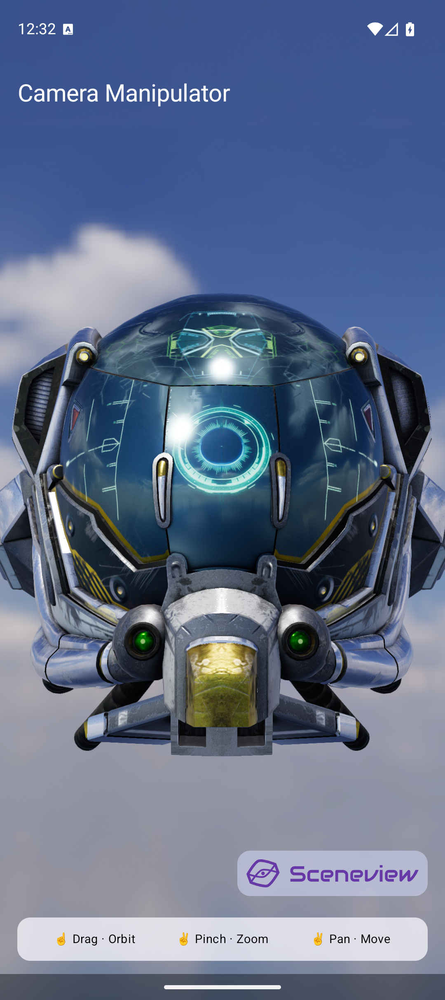
<span class="showcase-item__made-badge">Made with SceneView</span>
</div>
<div class="showcase-item__label">Camera Manipulator</div>
<div class="showcase-item__desc">Orbit, zoom, pan gestures on PBR model</div>
</div>
<div class="showcase-item">
<div class="showcase-item__wrapper">
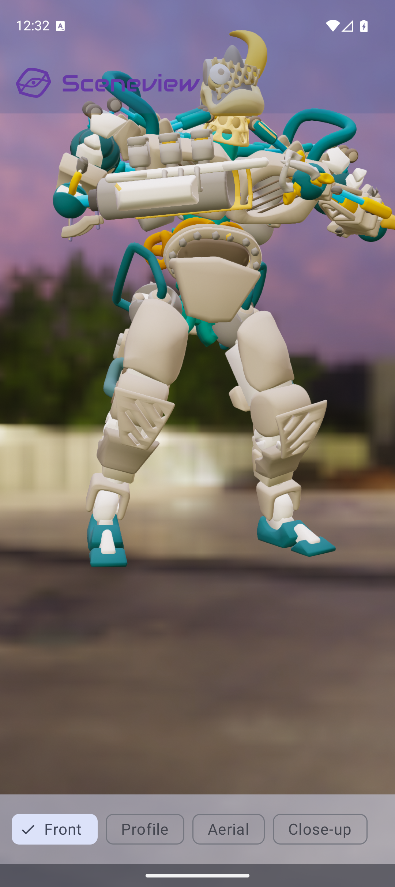
<span class="showcase-item__made-badge">Made with SceneView</span>
</div>
<div class="showcase-item__label">glTF Camera</div>
<div class="showcase-item__desc">Imported camera positions, sunset HDR</div>
</div>
<div class="showcase-item">
<div class="showcase-item__wrapper">
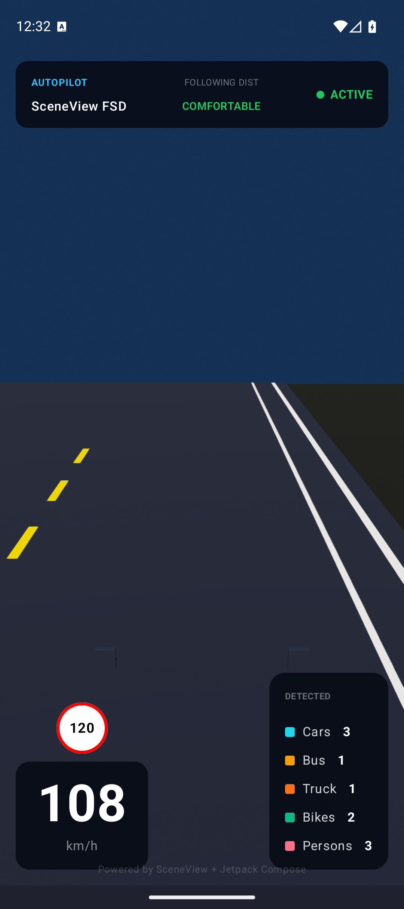
<span class="showcase-item__made-badge">Made with SceneView</span>
</div>
<div class="showcase-item__label">Autopilot HUD</div>
<div class="showcase-item__desc">3D road, speed, detection overlay</div>
</div>
</div>

<p class="device-section__subtitle">Feature previews</p>
<div class="showcase-gallery">
<div class="showcase-item">

<div class="showcase-item__label">Model Viewer</div>
<div class="showcase-item__desc">HDR lighting, orbit camera, animation playback</div>
</div>
<div class="showcase-item">

<div class="showcase-item__label">AR Placement</div>
<div class="showcase-item__desc">Plane detection, pinch to scale, tap to place</div>
</div>
<div class="showcase-item">

<div class="showcase-item__label">Physics Demo</div>
<div class="showcase-item__desc">Rigid bodies, gravity, collision, tap to throw</div>
</div>
<div class="showcase-item">

<div class="showcase-item__label">Dynamic Sky</div>
<div class="showcase-item__desc">Time-of-day cycle, turbidity, atmospheric fog</div>
</div>
<div class="showcase-item">

<div class="showcase-item__label">Post-Processing</div>
<div class="showcase-item__desc">Bloom, vignette, ACES tone mapping, FXAA</div>
</div>
<div class="showcase-item">

<div class="showcase-item__label">Camera Controls</div>
<div class="showcase-item__desc">Orbit, pan, zoom with gesture sensitivity</div>
</div>
<div class="showcase-item">

<div class="showcase-item__label">Line Paths</div>
<div class="showcase-item__desc">Lissajous curves, sine waves, animated paths</div>
</div>
<div class="showcase-item">

<div class="showcase-item__label">Text Labels</div>
<div class="showcase-item__desc">Billboard labels, extruded 3D text, anchored</div>
</div>
<div class="showcase-item">

<div class="showcase-item__label">Reflection Probes</div>
<div class="showcase-item__desc">Zone IBL, chrome, glass, gold materials</div>
</div>
<div class="showcase-item">
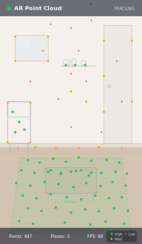
<div class="showcase-item__label">AR Point Cloud</div>
<div class="showcase-item__desc">ARCore feature points, confidence coloring</div>
</div>
</div>
</div>

<!-- ───── Android Tablet ───── -->
<div class="device-section">
<div class="device-section__header">
<span class="device-section__icon">📋</span>
<span class="device-section__title">Android Tablet</span>
<span class="device-section__badge device-section__badge--ready">Shipping today</span>
</div>
<div class="showcase-gallery">
<div class="showcase-item showcase-item--wide">
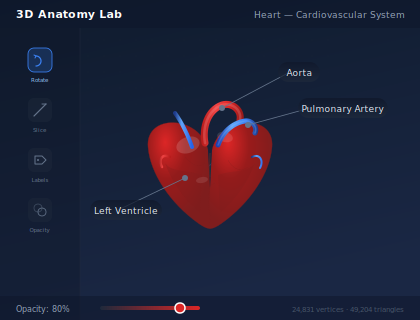
<div class="showcase-item__label">3D Anatomy Lab</div>
<div class="showcase-item__desc">Interactive heart model, annotations, opacity controls</div>
</div>
<div class="showcase-item showcase-item--wide">
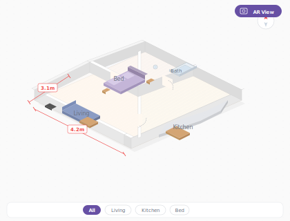
<div class="showcase-item__label">3D Floor Plans</div>
<div class="showcase-item__desc">Isometric rooms, measurements, AR staging</div>
</div>
<div class="showcase-item showcase-item--wide">
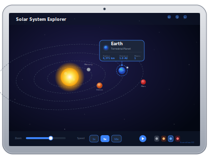
<div class="showcase-item__label">Solar System Explorer</div>
<div class="showcase-item__desc">Interactive planets, orbit rings, STEM education</div>
</div>
<div class="showcase-item showcase-item--wide">
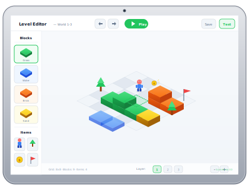
<div class="showcase-item__label">3D Level Editor</div>
<div class="showcase-item__desc">Isometric block placement, tool palette, play mode</div>
</div>
</div>
</div>

<!-- ───── Android Automotive ───── -->
<div class="device-section">
<div class="device-section__header">
<span class="device-section__icon">🚗</span>
<span class="device-section__title">Android Automotive</span>
<span class="device-section__badge device-section__badge--ready">Shipping today</span>
</div>
<div class="showcase-gallery">
<div class="showcase-item showcase-item--wide">
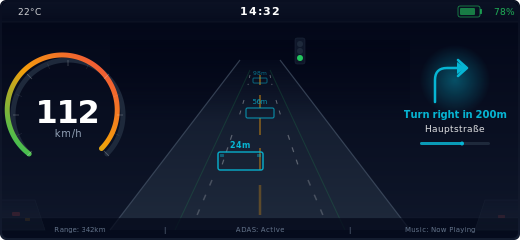
<div class="showcase-item__label">Head-Up Display</div>
<div class="showcase-item__desc">3D navigation, speed arc, lane assist, traffic lights</div>
</div>
<div class="showcase-item">
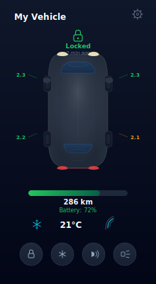
<div class="showcase-item__label">Companion App</div>
<div class="showcase-item__desc">Live 3D vehicle model, climate, battery status</div>
</div>
<div class="showcase-item">

<div class="showcase-item__label">Autopilot HUD</div>
<div class="showcase-item__desc">3D road overlay, turn-by-turn, ADAS indicators</div>
</div>
</div>
</div>

<!-- ───── XR Headsets ───── -->
<div class="device-section device-section--clickable">
<a href="v4-preview/" class="device-section__link">
<div class="device-section__header">
<span class="device-section__icon">🥽</span>
<span class="device-section__title">XR Headsets</span>
<span class="device-section__badge device-section__badge--coming">v4.0</span>
<span class="device-section__arrow">:octicons-arrow-right-24:</span>
</div>
</a>
<p class="device-section__desc">Same composable API — <code>XRScene { }</code> for spatial computing. Floating Compose UI via <code>ViewNode</code>.</p>
<div class="showcase-gallery">
<div class="showcase-item showcase-item--wide">

<div class="showcase-item__label">Spatial Showroom</div>
<div class="showcase-item__desc">Floating 3D models + Compose UI panels in space</div>
</div>
</div>
</div>

<!-- ───── iOS ───── -->
<div class="device-section device-section--clickable">
<a href="v4-preview/" class="device-section__link">
<div class="device-section__header">
<span class="device-section__icon">🍎</span>
<span class="device-section__title">iOS</span>
<span class="device-section__badge device-section__badge--coming">v4.1</span>
<span class="device-section__arrow">:octicons-arrow-right-24:</span>
</div>
</a>
<p class="device-section__desc">Kotlin Multiplatform + Filament Metal backend. Share your scene graph across Android and iOS.</p>
<div class="showcase-gallery">
<div class="showcase-item">
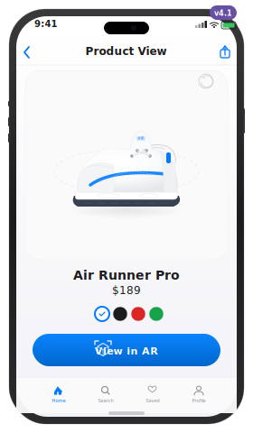
<div class="showcase-item__label">iOS Product Viewer</div>
<div class="showcase-item__desc">SwiftUI + RealityKit, same API patterns</div>
</div>
</div>
</div>

<!-- ───── TV · Desktop ───── -->
<div class="device-section device-section--clickable">
<a href="v4-preview/" class="device-section__link">
<div class="device-section__header">
<span class="device-section__icon">🖥️</span>
<span class="device-section__title">TV · Desktop</span>
<span class="device-section__badge device-section__badge--coming">v4.0</span>
<span class="device-section__arrow">:octicons-arrow-right-24:</span>
</div>
</a>
<p class="device-section__desc">Compose Multiplatform opens the door to Android TV, Desktop JVM, and every screen Kotlin reaches.</p>
<div class="showcase-gallery">
<div class="showcase-item showcase-item--wide">
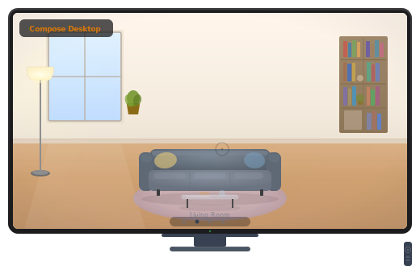
<div class="showcase-item__label">Virtual Showroom</div>
<div class="showcase-item__desc">Living room tour with room navigation, remote control</div>
</div>
</div>
</div>

---

## Get started

<div class="grid cards" markdown>

-   :octicons-play-24: **3D with Compose**

    ---

    Build your first 3D scene with a rotating glTF model, HDR lighting, and orbit camera gestures.

    **~25 minutes**

    [:octicons-arrow-right-24: Start the codelab](codelabs/codelab-3d-compose.md)

-   :octicons-play-24: **AR with Compose**

    ---

    Place 3D objects in the real world using ARCore plane detection and anchor tracking.

    **~20 minutes**

    [:octicons-arrow-right-24: Start the codelab](codelabs/codelab-ar-compose.md)

</div>

---

## Samples

15 working sample apps ship with the repository:

| Sample | What it demonstrates |
|---|---|
| `model-viewer` | 3D model, HDR environment, orbit camera, animation playback |
| `ar-model-viewer` | Tap-to-place, plane detection, pinch/rotate gestures |
| `camera-manipulator` | Orbit / pan / zoom camera with gesture hints |
| `dynamic-sky` | Time-of-day sun, turbidity, fog controls |
| `physics-demo` | Tap-to-throw balls, collision, gravity |
| `post-processing` | Bloom, depth-of-field, SSAO, fog toggles |
| `ar-augmented-image` | Real-world image detection + overlay |
| `ar-cloud-anchor` | Persistent cross-device anchors |
| `ar-point-cloud` | ARCore feature point visualisation |
| `autopilot-demo` | Autonomous driving HUD |
| `gltf-camera` | Cameras imported from a glTF file |
| `line-path` | Animated sine/Lissajous curves with PathNode |
| `text-labels` | Camera-facing 3D text labels (TextNode) |
| `reflection-probe` | Zone-based IBL overrides + material picker |
| `sceneview-demo` | Full showcase: Explore, Showcase, Gallery tabs |

---

## Switching from another library?

<div class="grid cards" markdown>

-   :octicons-arrow-switch-24: **Coming from Sceneform?**

    ---

    Sceneform was archived by Google in 2021. SceneView is the successor — modern Compose API, active development, full ARCore support.

    [:octicons-arrow-right-24: Migration guide](migration.md)

-   :octicons-git-compare-24: **Evaluating options?**

    ---

    Side-by-side comparison with Sceneform, Unity, raw ARCore, Rajawali, and other alternatives.

    [:octicons-arrow-right-24: Comparison](comparison.md)

</div>

---

<!-- Strong bottom CTA — visually distinct, per Evil Martians recommendation -->
<div class="bottom-cta" markdown>

## Start building in 5 minutes

One Gradle line. No XML. No OpenGL. Just Compose.

[:octicons-arrow-right-24: Start building now](quickstart.md){ .md-button .md-button--primary }
[:octicons-comment-discussion-24: Join Discord](https://discord.gg/UbNDDBTNqb){ .md-button }
[:octicons-mark-github-24: Star on GitHub](https://github.com/SceneView/sceneview-android){ .md-button }

</div>

<p class="footer-note">SceneView is open source (Apache 2.0). Built on Google Filament and ARCore. Android SDK 24+.<br>v4.0: Kotlin Multiplatform (iOS) · XR headsets · Android Automotive · TV · Desktop</p>
