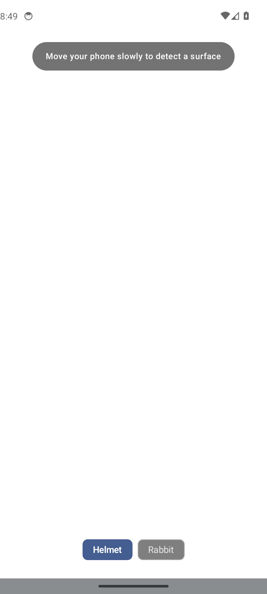

<div class="sv-hero" markdown>

# SceneView

<p class="sv-tagline">3D and AR as Compose UI. Build immersive experiences with the same tools you already know.</p>

<div class="sv-stats" markdown>
<span class="sv-stat">Jetpack Compose</span>
<span class="sv-stat">Google Filament</span>
<span class="sv-stat">ARCore</span>
<span class="sv-stat">Kotlin Multiplatform</span>
</div>

[Get started](codelabs/codelab-3d-compose.md){ .md-button .md-button--primary }
[View on GitHub](https://github.com/SceneView/sceneview){ .md-button }

</div>

## Write 3D the same way you write UI

Nodes are composables. Lifecycle is automatic. State drives everything.
No boilerplate — just `Scene { }` like you'd write `Column { }`.

```kotlin
Scene(modifier = Modifier.fillMaxSize()) {
    // Load a glTF model — returns null while loading, handles lifecycle
    rememberModelInstance(modelLoader, "models/helmet.glb")?.let { instance ->
        ModelNode(modelInstance = instance, scaleToUnits = 1.0f, autoAnimate = true)
    }
    // Add lighting
    LightNode(apply = { type(LightManager.Type.SUN) })
}
```

---

## Features

<div class="sv-features" markdown>

<div class="sv-feature-card" markdown>

<div class="sv-card-body" markdown>

### Model Viewer

Load and display glTF/GLB models with PBR materials, HDR environment lighting, and automatic animations. Orbit camera with gesture controls built-in.

</div>
</div>

<div class="sv-feature-card" markdown>

<div class="sv-card-body" markdown>

### Augmented Reality

Tap-to-place 3D objects on real-world surfaces. Full ARCore integration with plane detection, image tracking, and anchor persistence.

</div>
</div>

<div class="sv-feature-card" markdown>

<div class="sv-card-body" markdown>

### Camera Controls

Built-in orbit, pan, and zoom camera with smooth damping. Import camera animations from glTF files or control programmatically.

</div>
</div>

<div class="sv-feature-card" markdown>

<div class="sv-card-body" markdown>

### Image Tracking

Detect real-world images and overlay 3D content. Track multiple images simultaneously with ARCore's augmented image database.

</div>
</div>

</div>

---

## Install

=== "3D only"

    ```kotlin
    dependencies {
        implementation("io.github.sceneview:sceneview:3.2.0")
    }
    ```

=== "3D + AR"

    ```kotlin
    dependencies {
        implementation("io.github.sceneview:arsceneview:3.2.0")
    }
    ```

---

## AR is just as easy

```kotlin
ARScene(
    modifier = Modifier.fillMaxSize(),
    onSessionUpdated = { session, frame ->
        // Access ARCore frame data
    }
) {
    // Place a model when the user taps a detected plane
    val anchor = rememberAnchor()
    anchor?.let {
        AnchorNode(anchor = it) {
            rememberModelInstance(modelLoader, "models/chair.glb")?.let { instance ->
                ModelNode(modelInstance = instance, scaleToUnits = 0.5f)
            }
        }
    }
}
```

---

## Codelabs

<div class="grid cards" markdown>

-   **3D with Compose**

    ---

    Build your first 3D scene with a rotating glTF model, HDR lighting, and orbit camera gestures.

    ~25 minutes

    [:octicons-arrow-right-24: Start the codelab](codelabs/codelab-3d-compose.md)

-   **AR with Compose**

    ---

    Place 3D objects in the real world using ARCore plane detection and anchor tracking.

    ~20 minutes

    [:octicons-arrow-right-24: Start the codelab](codelabs/codelab-ar-compose.md)

</div>

---

## Samples

<div class="sv-gallery" markdown>





</div>

---

## Key concepts

### Nodes are composables

Every 3D object — models, lights, geometry, cameras — is a `@Composable` function inside `Scene { }`. No manual `addChildNode()` or `destroy()` calls.

### State drives the scene

Pass Compose state into node parameters. The scene updates on the next frame. Toggle a `Boolean` to show/hide a node. Update a `mutableStateOf<Anchor?>` to place content in AR.

### Everything is `remember`

The Filament engine, model loaders, environment, camera — all are `remember`-ed values with automatic cleanup. Create them, use them, forget about them.

### Kotlin Multiplatform ready

The core math, geometry, animation, and collision modules are fully cross-platform in `sceneview-core`. Shared logic for Android and iOS — renderer-independent.

---

## Upgrading from v2.x?

See the [Migration guide](migration.md) for a step-by-step walkthrough of every breaking change.

---

## Community

[Discord](https://discord.gg/UbNDDBTNqb){ .md-button }
[GitHub](https://github.com/SceneView/sceneview){ .md-button .md-button--primary }
