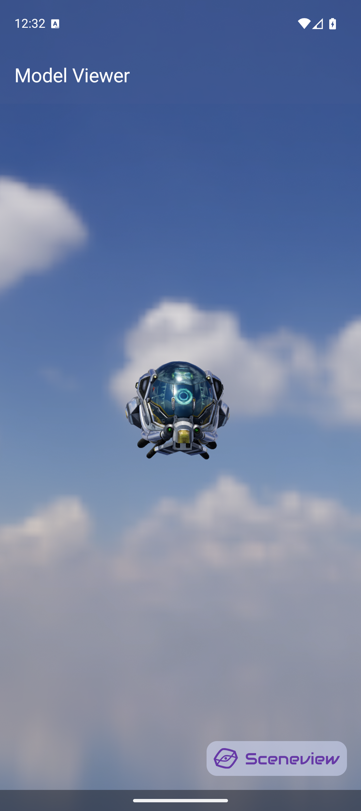
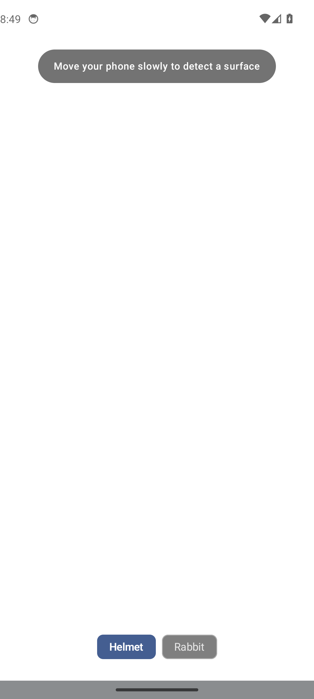
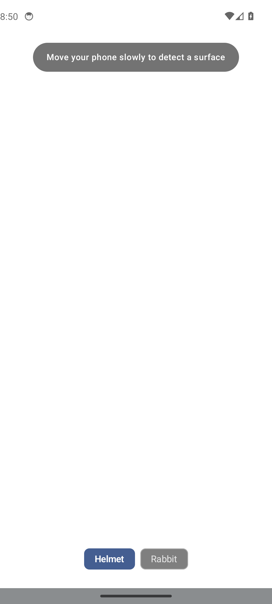

# Samples

15 working sample apps ship with the repository. Clone and run them to see SceneView in action.

```bash
git clone https://github.com/SceneView/sceneview.git
```

Open in Android Studio, select a sample module, and run on a device or emulator.

---

## 3D samples

### Model Viewer

{ width=320 }

Load a glTF/GLB model with HDR environment lighting, orbit camera, and animation playback controls.

```kotlin
Scene(
    modifier = Modifier.fillMaxSize(),
    cameraManipulator = rememberCameraManipulator(),
    environment = environment
) {
    rememberModelInstance(modelLoader, "models/helmet.glb")?.let {
        ModelNode(modelInstance = it, scaleToUnits = 1.0f, autoAnimate = true)
    }
}
```

**Demonstrates:** `ModelNode`, `rememberModelInstance`, `rememberCameraManipulator`, HDR environments, animation controls

---

### Camera Manipulator

{ width=320 }

Orbit, pan, and zoom with gesture hints.

**Demonstrates:** `CameraManipulator`, one-finger orbit, pinch-zoom, two-finger pan

---

### glTF Camera

{ width=320 }

Use cameras defined inside a glTF file. The scene animates between camera viewpoints imported from Blender.

**Demonstrates:** `CameraNode`, glTF-embedded cameras, animated transitions

---

### Dynamic Sky


Time-of-day sun positioning with turbidity and fog controls. Sunrise, noon, sunset — all driven by a Compose slider.

**Demonstrates:** `DynamicSkyNode`, `FogNode`, reactive lighting from Compose state

---

### Reflection Probe


Metallic surfaces with local cubemap reflections that override the global environment.

**Demonstrates:** `ReflectionProbeNode`, IBL override, metallic materials

---

### Physics Demo


Tap the screen to throw balls. They bounce off the floor and each other with rigid body physics.

**Demonstrates:** `PhysicsNode`, gravity, collision detection, tap-to-throw interaction

---

### Post-Processing


Toggle visual effects: bloom, depth-of-field, SSAO, and fog. See the difference each makes.

**Demonstrates:** Filament post-processing pipeline, `View` options, composable toggles

---

### Line & Path


3D line drawing, axis gizmos, spiral curves, and animated sine-wave paths.

**Demonstrates:** `LineNode`, `PathNode`, `updateGeometry()`, GPU line primitives

---

### Text Labels


Camera-facing text labels floating above 3D spheres. Tap to cycle text.

**Demonstrates:** `TextNode`, `BillboardNode`, Canvas-rendered text in 3D space

---

### Autopilot Demo

A fully autonomous 3D scene — no user interaction needed. Compose state drives everything.

{ width=320 }

**Demonstrates:** Pure state-driven 3D, `rememberInfiniteTransition`, automatic animation

---

## AR samples

### AR Model Viewer

{ width=320 }

Tap to place a 3D model on a detected plane. Pinch to scale, drag to move, two-finger rotate. Multiple models supported.

```kotlin
ARScene(
    planeRenderer = true,
    onSessionUpdated = { _, frame ->
        // Detect planes and create anchors
    }
) {
    anchor?.let { a ->
        AnchorNode(anchor = a) {
            ModelNode(modelInstance = model, scaleToUnits = 0.5f)
        }
    }
}
```

**Demonstrates:** `ARScene`, `AnchorNode`, `ModelNode` gestures, plane detection, persistent plane mesh

---

### AR Augmented Image

{ width=320 }

Detect a real-world image and overlay 3D content on it.

**Demonstrates:** `AugmentedImageNode`, `AugmentedImageDatabase`, image tracking, video overlay

---

### AR Cloud Anchor


Host an anchor to Google Cloud and resolve it on another device. Cross-device AR persistence.

**Demonstrates:** `CloudAnchorNode`, anchor hosting/resolving, `CloudAnchorState`

---

### AR Point Cloud


Visualize ARCore's feature points as a real-time point cloud.

**Demonstrates:** ARCore feature points, point cloud rendering, `onSessionUpdated`

---

## Running AR samples

AR samples require:

- A physical device with [ARCore support](https://developers.google.com/ar/devices)
- ARCore (Google Play Services for AR) installed from Play Store
- Camera permission granted

!!! tip
    For best AR tracking, use a well-lit environment with textured surfaces (wood tables, carpet — not glass or plain white surfaces).
