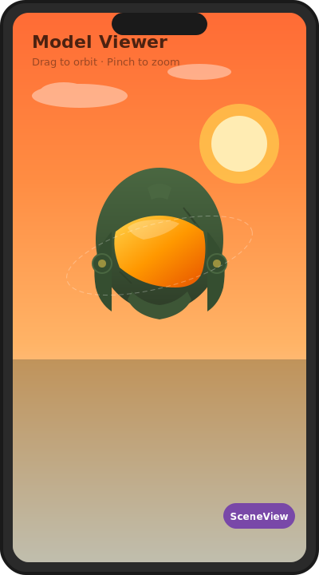
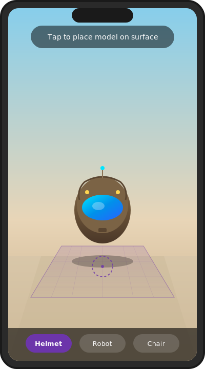
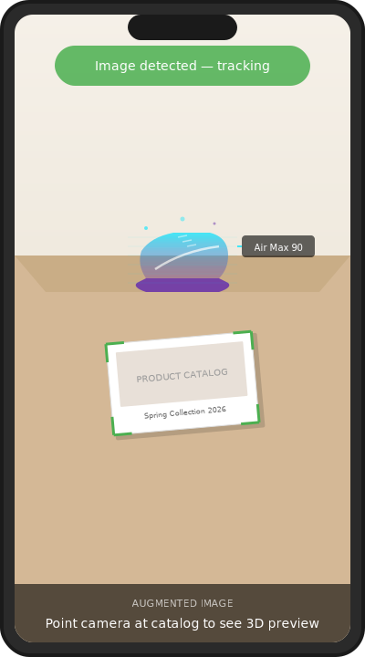
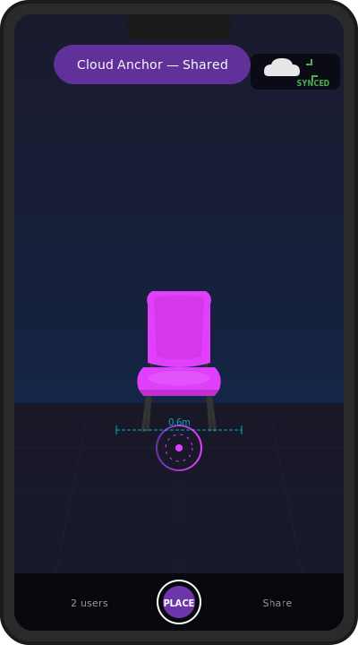

# Showcase

Real apps and demos built with SceneView — all running on Jetpack Compose.

---

## 3D Scenes

<div class="showcase-grid showcase-grid--full" markdown>

<div class="showcase-card" markdown>


### Model Viewer

Load any glTF/GLB model with HDR environment lighting. Orbit camera with drag, pinch-to-zoom, and double-tap-to-scale gestures. Async model loading with `rememberModelInstance`.

```kotlin
Scene(modifier = Modifier.fillMaxSize()) {
    rememberModelInstance(modelLoader, "helmet.glb")?.let {
        ModelNode(modelInstance = it, scaleToUnits = 1.0f)
    }
}
```

[:octicons-code-24: View source](https://github.com/SceneView/sceneview-android/tree/main/samples/model-viewer){ .showcase-link }
</div>

<div class="showcase-card" markdown>


### Autopilot HUD

Full autonomous driving interface — road, lane markers, speed HUD, object detection panel — built entirely with `CubeNode`, `PlaneNode`, `ViewNode` and Compose state. Zero model files.

Demonstrates how SceneView can power data-driven 3D dashboards and HUDs with reactive state updates.

[:octicons-code-24: View source](https://github.com/SceneView/sceneview-android/tree/main/samples/autopilot-demo){ .showcase-link }
</div>

</div>

---

## AR Experiences

<div class="showcase-grid showcase-grid--full" markdown>

<div class="showcase-card" markdown>


### AR Tap-to-Place

Detect horizontal surfaces with ARCore, tap to create an anchor, and place a 3D model. Supports model picker, pinch-to-scale, and drag-to-rotate gestures.

```kotlin
ARScene(planeRenderer = true, onSessionUpdated = { _, frame ->
    anchor = frame.getUpdatedPlanes().firstOrNull()
        ?.let { frame.createAnchorOrNull(it.centerPose) }
}) {
    anchor?.let { AnchorNode(it) { ModelNode(instance) } }
}
```

[:octicons-code-24: View source](https://github.com/SceneView/sceneview-android/tree/main/samples/ar-model-viewer){ .showcase-link }
</div>

<div class="showcase-card" markdown>


### Augmented Image

Detect real-world printed images and overlay interactive 3D content. Use cases: product catalogs, educational materials, AR business cards, museum exhibits.

ARCore tracks the image in real-time and `AugmentedImageNode` keeps the 3D content anchored to it.

[:octicons-code-24: View source](https://github.com/SceneView/sceneview-android/tree/main/samples/ar-augmented-image){ .showcase-link }
</div>

<div class="showcase-card" markdown>


### Cloud Anchors

Persistent, cross-device AR anchors powered by Google Cloud. Place a 3D object, share the anchor ID, and another device can resolve and see the same object in the same location.

Perfect for collaborative AR, shared installations, and multiplayer experiences.

[:octicons-code-24: View source](https://github.com/SceneView/sceneview-android/tree/main/samples/ar-cloud-anchor){ .showcase-link }
</div>

</div>

---

## Node types available

SceneView 3.2.0 ships with a rich library of composable node types:

| Node | Description |
|---|---|
| `ModelNode` | glTF/GLB model with animations, gestures, PBR materials |
| `LightNode` | Directional, point, spot, sun lights |
| `CubeNode` / `SphereNode` / `CylinderNode` / `PlaneNode` | Built-in geometry primitives |
| `ImageNode` | Image rendered on a 3D plane |
| `ViewNode` | Any Compose UI as a 3D billboard |
| `TextNode` | 3D text geometry |
| `LineNode` / `PathNode` | 3D polylines and paths |
| `BillboardNode` | Always faces the camera (labels, tooltips) |
| `PhysicsNode` | Rigid body with gravity and collisions |
| `DynamicSkyNode` | Time-of-day sun position |
| `FogNode` | Distance/height fog |
| `ReflectionProbeNode` | Zone-based IBL reflections |
| `AnchorNode` | AR world anchor (ARScene only) |
| `AugmentedImageNode` | AR image tracking (ARScene only) |
| `CloudAnchorNode` | Persistent cross-device anchor (ARScene only) |

---

## Build something?

We'd love to feature your project here. [Open a PR](https://github.com/SceneView/sceneview-android/pulls) or share it on [Discord](https://discord.gg/UbNDDBTNqb).
