# Why SceneView

SceneView is the only actively maintained, Compose-native 3D and AR library for Kotlin.
It delivers Filament's physically-based rendering and ARCore's full AR capabilities through
a declarative API that developers already understand. SceneViewSwift (v3.5.2 alpha) brings
the same experience to iOS, macOS, and visionOS via RealityKit — and v4.0 will add XR headsets
and cross-framework bridges.

<div class="showcase-gallery">

<div class="showcase-item">
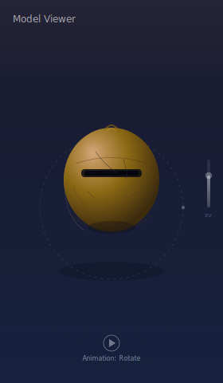
<div class="showcase-item__label">Model Viewer</div>
</div>

<div class="showcase-item">
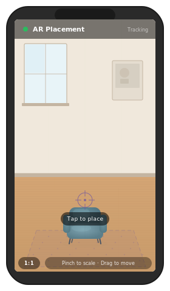
<div class="showcase-item__label">AR Placement</div>
</div>

<div class="showcase-item">
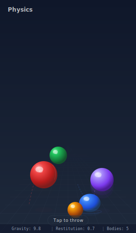
<div class="showcase-item__label">Physics</div>
</div>

<div class="showcase-item">
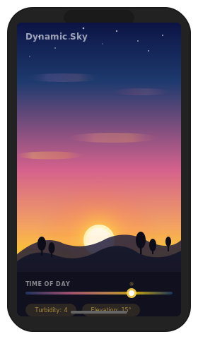
<div class="showcase-item__label">Dynamic Sky</div>
</div>

<div class="showcase-item">
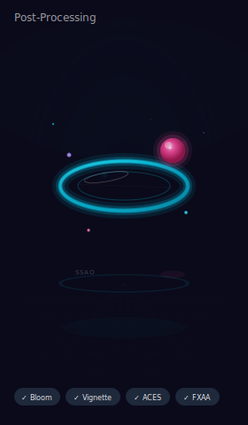
<div class="showcase-item__label">Post-Processing</div>
</div>

<div class="showcase-item">
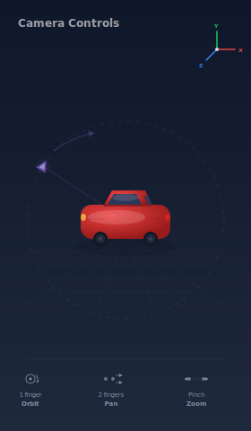
<div class="showcase-item__label">Camera</div>
</div>

<div class="showcase-item">
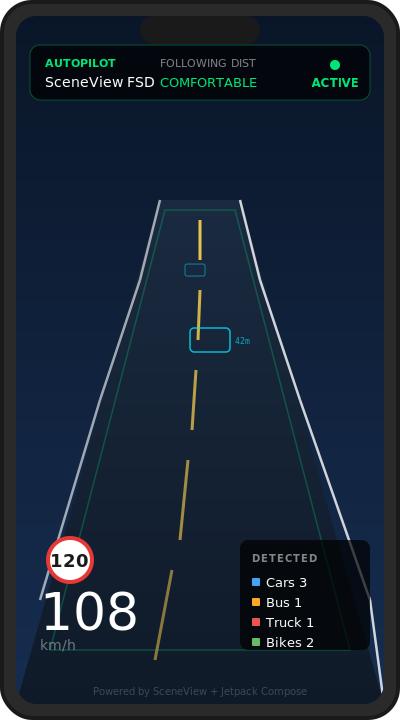
<div class="showcase-item__label">Autopilot HUD</div>
</div>

<div class="showcase-item">
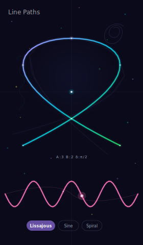
<div class="showcase-item__label">Line Paths</div>
</div>

<div class="showcase-item">
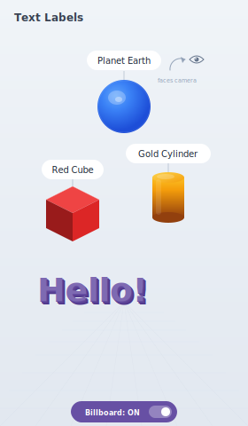
<div class="showcase-item__label">Text Labels</div>
</div>

<div class="showcase-item">
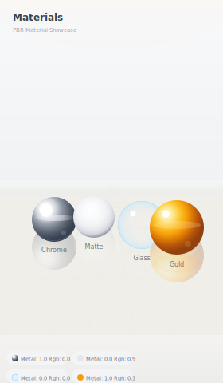
<div class="showcase-item__label">Reflections</div>
</div>

</div>

---

## The pitch in 10 seconds

```kotlin
Scene(modifier = Modifier.fillMaxSize()) {
    ModelNode(modelInstance = helmet, scaleToUnits = 1.0f, autoAnimate = true)
    LightNode(type = LightManager.Type.SUN, apply = { intensity(100_000.0f) })
}
```

That's a production-quality 3D viewer. Five lines. Same Kotlin you write every day.

---

## What makes SceneView different

### Compose-native — not a wrapper

60% of the top 1,000 Play Store apps use Jetpack Compose. SceneView's scene graph **is** the
Compose tree. The Compose runtime owns it.

- `if/else` controls whether nodes exist
- `State<T>` drives animations, positions, visibility
- `LaunchedEffect` and `DisposableEffect` work inside scenes
- Nesting nodes = nesting `Column { Row { Text() } }`

### Zero boilerplate lifecycle

```kotlin
val engine = rememberEngine()
val modelLoader = rememberModelLoader(engine)
val model = rememberModelInstance(modelLoader, "models/product.glb")
// All resources destroyed automatically when composable leaves the tree
```

No `onPause`/`onResume` dance. No `destroy()` calls. No leaked Filament objects.

### Thread safety by default

Filament requires all JNI calls on the main thread. `rememberModelInstance` handles the
IO-to-main-thread transition automatically. You never think about it.

### Gesture handling built in

`ModelNode` supports pinch-to-scale, drag-to-rotate, and two-finger-rotate out of the box.
Orbit camera in one line:

```kotlin
Scene(cameraManipulator = rememberCameraManipulator()) { ... }
```

### Multi-platform trajectory

SceneViewSwift v3.5.2 (alpha) already supports iOS, macOS, and visionOS via RealityKit.
v4.0 will add `XRScene` for spatial computing headsets and cross-framework bridges
(Flutter, React Native, KMP Compose). One declarative API across all target platforms.

### AI-assisted development

SceneView ships with an MCP server (`sceneview-mcp`) and a machine-readable `llms.txt` API
reference. Claude, Cursor, and other AI tools always have the current API — no hallucinated
methods, no outdated patterns.

---

## 26+ composable node types

| Category | Nodes |
|---|---|
| **Models** | `ModelNode` — glTF/GLB with animations, gestures, scaling |
| **Geometry** | `CubeNode`, `SphereNode`, `CylinderNode`, `PlaneNode` — no asset files needed |
| **Lighting** | `LightNode` (sun, point, spot, directional), `DynamicSkyNode`, `ReflectionProbeNode` |
| **Atmosphere** | `FogNode` — distance/height fog driven by Compose state |
| **Media** | `ImageNode`, `VideoNode` (with chromakey), `ViewNode` (any Composable in 3D) |
| **Text** | `TextNode`, `BillboardNode` — camera-facing labels and UI callouts |
| **Drawing** | `LineNode`, `PathNode` — 3D polylines, measurements, animated paths |
| **Physics** | `PhysicsNode` — rigid body simulation, collision, gravity |
| **AR** | `AnchorNode`, `HitResultNode`, `AugmentedImageNode`, `AugmentedFaceNode`, `CloudAnchorNode`, `StreetscapeGeometryNode` |
| **XR** | `XRScene` — spatial computing with the same composable API |
| **Structure** | `Node` (grouping/pivots), `CameraNode`, `MeshNode` |

---

## Production rendering — Google Filament

Built on [Filament](https://github.com/google/filament), the same physically-based
rendering engine used inside Google Search and Google Play Store.

- Physically-based rendering (PBR) with metallic/roughness workflow
- HDR environment lighting (IBL) from `.hdr` and `.ktx` files
- Dynamic shadows, reflections, ambient occlusion
- Post-processing: bloom, depth-of-field, SSAO, fog
- 60fps on mid-range devices

---

## Full ARCore integration

```kotlin
ARScene(
    planeRenderer = true,
    onSessionUpdated = { _, frame ->
        anchor = frame.getUpdatedPlanes()
            .firstOrNull { it.type == Plane.Type.HORIZONTAL_UPWARD_FACING }
            ?.let { frame.createAnchorOrNull(it.centerPose) }
    }
) {
    anchor?.let { a ->
        AnchorNode(anchor = a) {
            ModelNode(modelInstance = sofa, scaleToUnits = 0.5f)
        }
    }
}
```

- Plane detection (horizontal + vertical) with persistent mesh rendering
- Image detection and tracking (`AugmentedImageNode`)
- Face mesh tracking and augmentation (`AugmentedFaceNode`)
- Cloud anchors for cross-device persistence (`CloudAnchorNode`)
- Environmental HDR — real-world light estimation
- Streetscape geometry — city-scale 3D building meshes
- Geospatial API support — place content at lat/long coordinates

---

## Real-world use cases

<div class="showcase-gallery">

<div class="showcase-item">
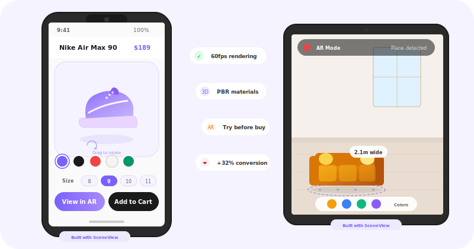
<div class="showcase-item__label">E-commerce</div>
</div>

<div class="showcase-item">
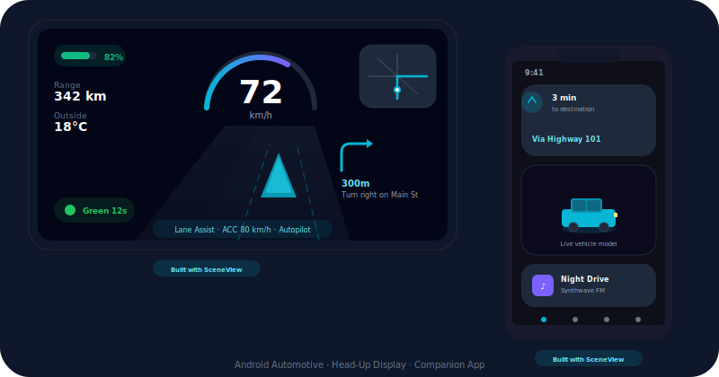
<div class="showcase-item__label">Automotive</div>
</div>

<div class="showcase-item">
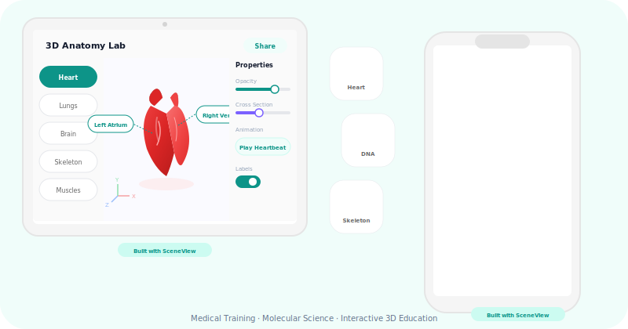
<div class="showcase-item__label">Healthcare</div>
</div>

<div class="showcase-item">
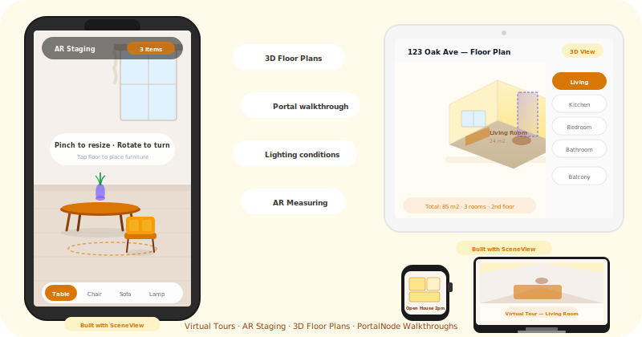
<div class="showcase-item__label">Real Estate</div>
</div>

<div class="showcase-item">
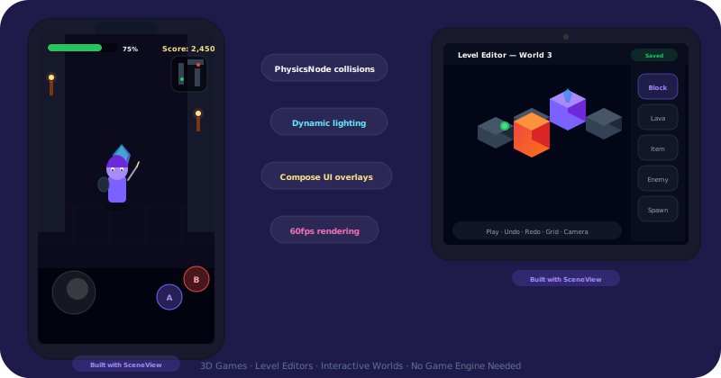
<div class="showcase-item__label">Gaming</div>
</div>

<div class="showcase-item">
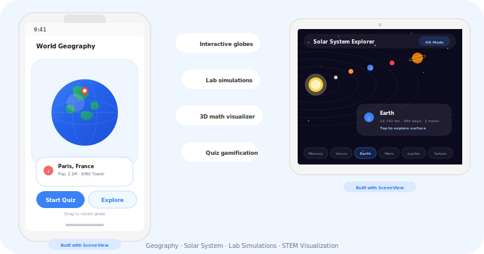
<div class="showcase-item__label">Education</div>
</div>

</div>

### E-commerce: product viewer in 10 lines

Replace a static `Image()` with a `Scene {}` on your product detail page:

```kotlin
Scene(
    modifier = Modifier.fillMaxWidth().height(300.dp),
    cameraManipulator = rememberCameraManipulator()
) {
    rememberModelInstance(modelLoader, "models/shoe.glb")?.let {
        ModelNode(modelInstance = it, scaleToUnits = 1.0f)
    }
}
```

### Furniture & interior design

Let customers see how a sofa looks in their living room. Tap to place, pinch to resize,
rotate with two fingers. Compose UI floats alongside via `ViewNode`.

### Education & training

Interactive 3D anatomy models, molecular structures, mechanical assemblies — controlled
by standard Compose sliders, buttons, and state.

### Data visualization

3D bar charts, globes, network graphs. The data is Compose `State` — update it and
the visualization reacts instantly.

### Social & communication

`AugmentedFaceNode` for face filters and effects. Apply materials to the face mesh,
attach 3D objects to landmarks. Front-camera AR.

---

## The numbers

| Metric | Value |
|---|---|
| **Node types** | 26+ composable nodes |
| **Rendering** | Google Filament — PBR, 60fps mobile |
| **AR backend** | ARCore — latest features |
| **Platforms** | Android (stable) + iOS/macOS/visionOS (alpha) |
| **Setup** | 1 Gradle line, 0 XML |
| **Model viewer** | ~5 lines of Kotlin |
| **AR placement** | ~15 lines of Kotlin |
| **APK size impact** | ~5 MB |
| **License** | Apache 2.0 |
