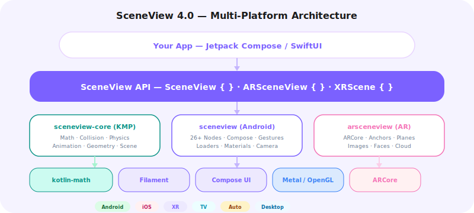

# SceneView v4 Preview — Multi-Platform

> **Status**: Design phase. The v4 milestone is about expanding SceneView beyond Android while maintaining the Compose-first philosophy.

<div style="text-align: center; margin: 1.5rem 0;">

</div>

!!! info "v3.3.0 is production-ready today"
    You don't need to wait for 4.0. Everything below adds capabilities on top — it doesn't
    replace anything. [Get started now](index.md#install-in-30-seconds).

---

## The journey

| Version | Theme |
|---|---|
| **2.x** | View-based Sceneform successor |
| **3.0** | Compose rewrite — "3D is just Compose UI" |
| **3.1** | `rememberModelInstance`, camera manipulator, gesture polish |
| **3.2** | Physics, dynamic sky, fog, reflections, lines, text, post-processing |
| **4.0** | Multi-scene, portals, XR, Kotlin Multiplatform |

---

## What's Coming

### Kotlin Multiplatform Core

SceneView v4 will extract the platform-independent layers (scene graph, math, asset loading, physics) into a Kotlin Multiplatform module. This means:

- **Shared scene graph** across Android, iOS, Desktop, and Web
- **Shared asset pipeline** for glTF/GLB loading
- **Shared math library** already based on kotlin-math
- **Platform-specific renderers** using Filament's native backends

### Android XR Support

With Android XR launching, SceneView v4 will add:

- `XRScene { }` composable for immersive 6DoF experiences
- Spatial anchors and hand tracking
- Eye tracking-aware rendering
- Passthrough AR on XR headsets

### New Platforms

!!! note "iOS, macOS, visionOS already available"
    SceneViewSwift v3.3.0 (alpha) ships today with RealityKit rendering.
    v4.0 focuses on Android XR, cross-framework bridges, and deeper KMP integration.

| Platform | Composable | Renderer | Status |
|---|---|---|---|
| Android | `Scene { }` | Filament (OpenGL ES / Vulkan) | Stable (v3.3.0) |
| iOS / macOS / visionOS | `SceneView { }` (SwiftUI) | RealityKit (Metal) | Alpha (v3.3.0) |
| Android XR | `XRScene { }` | Filament (Vulkan) | v4.0 |
| Desktop | `Scene { }` (Compose Desktop) | Filament (OpenGL / Vulkan) | Planned |
| Web | `Scene { }` (Compose HTML) | Filament (WebGPU) | Research |

---

## Multiple `Scene {}` on one screen

Today, you get one `Scene` per screen. In 4.0, multiple independent scenes share a single
Filament `Engine`, each with its own camera, environment, and node tree.

```kotlin
@Composable
fun DashboardScreen() {
    Column {
        // Product hero
        Scene(
            modifier = Modifier.fillMaxWidth().height(300.dp),
            engine = engine,
            environment = studioEnvironment
        ) {
            ModelNode(modelInstance = product, scaleToUnits = 1.0f)
        }

        // Inline data globe — different camera, different lighting
        Scene(
            modifier = Modifier.size(200.dp),
            engine = engine,
            environment = darkEnvironment
        ) {
            SphereNode(radius = 0.5f, materialInstance = globeMaterial)
        }

        // Standard Compose content
        LazyColumn { /* cards, charts, text */ }
    }
}
```

Dashboards, e-commerce feeds, social timelines — 3D elements mixed freely with
`LazyColumn`, `Pager`, `BottomSheet`.

---

## `PortalNode` — a scene inside a scene

Render a secondary scene inside a 3D frame. A window into another world.

```kotlin
Scene(modifier = Modifier.fillMaxSize()) {
    ModelNode(modelInstance = room, scaleToUnits = 2.0f)

    // A portal on the wall
    PortalNode(
        position = Position(0f, 1.5f, -2f),
        size = Size(1.2f, 1.8f),
        scene = portalScene
    ) {
        ModelNode(modelInstance = fantasyLandscape, scaleToUnits = 5.0f)
        DynamicSkyNode(sunPosition = Position(0.2f, 0.8f, 0.3f))
        FogNode(density = 0.05f, color = Color(0.6f, 0.7f, 1.0f))
    }
}
```

**Use cases:** AR portals, product showcases with custom lighting, game level transitions,
real estate walkthroughs.

---

## SceneView-XR — spatial computing

A new module for XR headsets and passthrough AR.
Same composable API — now in spatial environments.

```kotlin
implementation("io.github.sceneview:sceneview-xr:4.0.0")
```

```kotlin
XRScene(modifier = Modifier.fillMaxSize()) {
    ModelNode(
        modelInstance = furniture,
        position = Position(0f, 0f, -2f)
    )

    ViewNode(position = Position(0.5f, 1.5f, -1.5f)) {
        Card {
            Text("Tap to customize")
            ColorPicker(onColorSelected = { /* update material */ })
        }
    }
}
```

Your existing 3D/AR code patterns transfer directly to spatial computing.

---

## Kotlin Multiplatform

Share scene logic between Android and Apple platforms from a single Kotlin codebase. Each platform uses its native renderer — Filament on Android, RealityKit on Apple. KMP shares math, collision, geometry, and animation algorithms.

```kotlin
// commonMain — shared across platforms
@Composable
fun ProductViewer(modelPath: String) {
    Scene(modifier = Modifier.fillMaxSize()) {
        rememberModelInstance(modelLoader, modelPath)?.let { instance ->
            ModelNode(modelInstance = instance, scaleToUnits = 1.0f)
        }
    }
}
```

Write once, render natively on both platforms.

### API Evolution

The v4 API will be backwards-compatible with v3 for Android. New platforms will use the same node DSL:

```kotlin
// Same code works on Android, Desktop, and Web via KMP
Scene(modifier = Modifier.fillMaxSize()) {
    rememberModelInstance(modelLoader, "models/helmet.glb")?.let { instance ->
        ModelNode(modelInstance = instance, scaleToUnits = 1.0f)
    }
}
```

---

## Also in 4.0

- **Filament 2.x migration** — improved performance, better materials, reduced memory
- **`ParticleNode`** — GPU particle system for fire, smoke, sparkles, confetti
- **`AnimationController`** — composable-level animation blending, cross-fading, and layering
- **`CollisionNode`** — declarative collision detection between scene nodes

---

## Timeline

| Milestone | Target | Scope |
|---|---|---|
| v3.3 | Q2 2026 | Collision system rewrite, performance optimizations |
| v3.4 | Q3 2026 | Android XR preview, API stabilization |
| v4.0-alpha | Q4 2026 | KMP core extraction, Desktop preview |
| v4.0-beta | Q1 2027 | iOS preview, Web preview |
| v4.0 | Q2 2027 | Stable multi-platform release |

---

## Who should care about 4.0

<div class="grid cards" markdown>

-   :octicons-package-24: **E-commerce teams**

    ---

    Multi-scene lets you embed 3D product viewers in `LazyColumn` feeds, `BottomSheet` configurators, and `Pager` carousels — all on one screen, all with independent cameras.

-   :octicons-home-24: **Real estate / architecture**

    ---

    `PortalNode` lets users peek through doors into furnished rooms, walk through 3D floor plans, and compare lighting conditions — all without loading separate screens.

-   :octicons-device-desktop-24: **XR teams**

    ---

    `SceneView-XR` means the same code and patterns you build for phone AR transfer directly to XR headsets. No new framework to learn.

-   :octicons-globe-24: **Cross-platform teams**

    ---

    Kotlin Multiplatform means you can share scene definitions between Android and iOS. One Kotlin codebase, two platforms.

</div>

---

## Summary

| Limitation today | v4.0 solution |
|---|---|
| One Scene per screen | Multiple independent Scenes |
| Flat scene graph | `PortalNode` — scenes within scenes |
| Android only | Kotlin Multiplatform (iOS, Desktop, Web) |
| Phone/tablet only | `SceneView-XR` for spatial computing |

---

## How to Get Involved

- **Join the discussion**: [Discord #v4-planning](https://discord.gg/UbNDDBTNqb)
- **Contribute**: Check [CONTRIBUTING.md](contributing.md) for guidelines
- **Sponsor**: Help fund multi-platform development on [Open Collective](https://opencollective.com/sceneview)

[:octicons-arrow-right-24: Full roadmap on GitHub](https://github.com/sceneview/sceneview/blob/main/ROADMAP.md)
